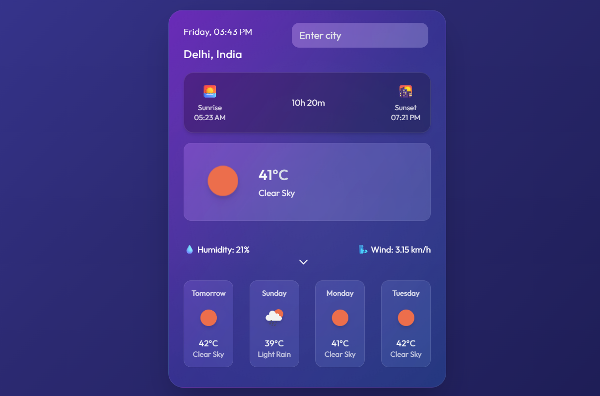
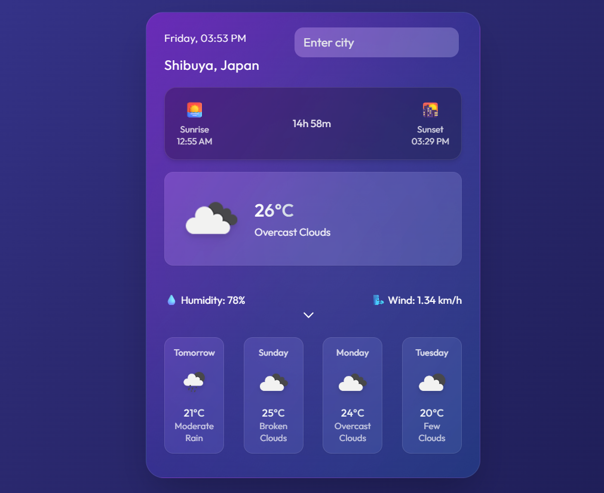
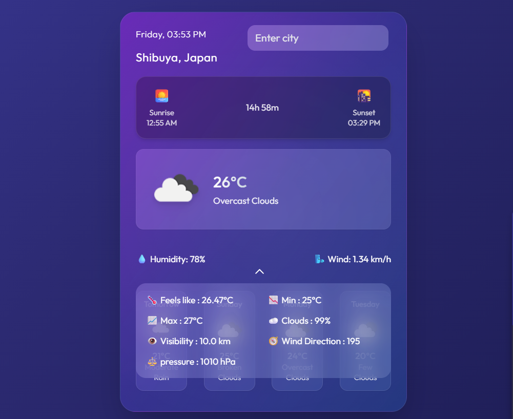

# 🌦️ MausamMate

A simple and elegant **Flask-based weather web application** that fetches real-time weather data using an external API and displays it through a clean and interactive user interface.

---
🌐 Live Demo

MausamMate — Live Demo - https://mausammate-weather-app.onrender.com
---
## 🚀 Features

* 🌍 Search weather by city name
* 📡 Real-time weather data using API
* 🎨 Clean and responsive UI
* 🔽 Interactive dropdown for detailed weather info
* 🔐 Secure API key management using environment variables

---

## 🛠️ Tech Stack

* **Backend:** Flask
* **Frontend:** HTML, CSS, JavaScript
* **API:** OpenWeather API
* **Environment Management:** python-dotenv

---

## ⚙️ Installation & Setup

### 1. Clone the repository

```bash
git clone https://github.com/your-username/mausammate.git
cd mausammate
```

### 2. Create a virtual environment

```bash
python -m venv venv
```

### 3. Activate the environment

```bash
# Windows
venv\Scripts\activate

# Mac/Linux
source venv/bin/activate
```

### 4. Install dependencies

```bash
pip install -r requirements.txt
```

### 5. Create `.env` file

Create a file named `.env` in the root directory and add:

```env
SECRET_KEY=your_secret_key_here
API_KEY=your_openweather_api_key
```

---

## ▶️ Run the Application

```bash
python app.py
```

Then open your browser and go to:

```
http://127.0.0.1:5000/
```

---

## 📸 Screenshots

### 🏠 Home Page


### 🌤️ Weather Result


### 🔽 Detailed View


---

## 📌 Project Structure

```
mausammate/
|__ screenshots/
│── static/
│── templates/
│── app.py
│── requirements.txt
│── .gitignore
│── .env.example
│── README.md
```


## 🙌 Acknowledgements

* OpenWeather API for providing weather data
* Flask for lightweight web framework support

